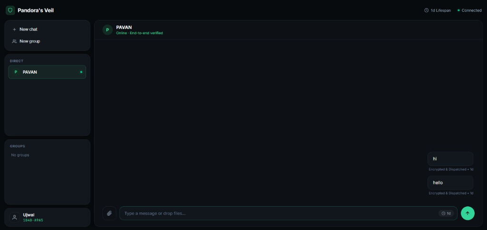
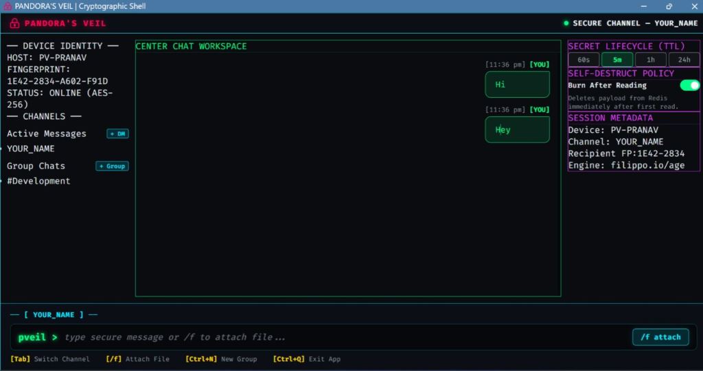

# Pandora's Veil
### Device-Bound Zero-Knowledge Secret Relay, Web Dashboard & Real-Time Terminal Interface

[](https://go.dev/)
[](https://filippo.io/age)
[](https://pandoras-veil.onrender.com/health)
[](https://redis.io/)
[](#security-architecture--threat-model)
[](LICENSE)

> "The share link locates the secret. The authorized device authorizes decryption."
> 
> *North Star Guarantee: "Even if the link leaks, the secret does not."*

---

## Overview

**Pandora's Veil** is a native, device-bound zero-knowledge secret-sharing and real-time communication system. It eliminates the structural vulnerabilities of traditional in-browser pastebins (such as PrivateBin) by executing all cryptographic operations inside a native compiled binary where private keys never leave physical devices.

Users can operate Pandora's Veil using either the **Web Dashboard** or the **Terminal Interface**, with identical end-to-end cryptographic guarantees.

---

## Interfaces

### 1. Web Dashboard
A modular web application running locally on `http://localhost:8080` backed by a local Go daemon. Protected by strict DNS Rebinding and Localhost CSRF firewalls. All cryptographic operations (key generation, X25519 encryption, decryption) execute inside the native Go binary, ensuring zero in-browser JavaScript cryptography.



### 2. Terminal Interface
A high-speed terminal environment for command-line workflows. Supports real-time peer-to-peer chats, group messaging, file transfers, and out-of-band fingerprint verification directly inside any terminal window.



---

## The Problem and Our Solution

### The Problems with Traditional Pastebins
1. **Per-Visit Browser Trust**: In-browser JavaScript encryption forces users to re-trust the web server on every page load. A compromised web server or CDN can inject malicious JavaScript to intercept secrets in memory.
2. **Link-Is-The-Only-Guard**: Anyone who acquires a traditional paste link (through chat leaks, shoulder surfing, or compromised clipboards) can decrypt the secret.
3. **No Device Authorization**: Standard secret bins protect data in transit, but cannot guarantee that only a specific physical laptop or server can unlock the payload.
4. **Localhost Vulnerabilities**: Local web interfaces often leave local ports exposed to cross-origin requests from arbitrary websites running in other browser tabs.

### Our Solution
- **Native Compiled Client (`pv`)**: Cryptography executes strictly in a compiled Go binary (`filippo.io/age`). Trust is established once at installation, completely bypassing browser JavaScript vulnerabilities.
- **Device-Bound Encryption**: Secrets are encrypted locally targeting the recipient's physical X25519 public key. Possession of the URL alone grants zero access—decryption strictly requires the recipient's local private key.
- **Mandatory Hard-Stop Fingerprint Verification**: Senders verify the recipient's 8-character device fingerprint out-of-band before encryption occurs, defeating relay key-substitution (MITM) attacks.
- **Atomic Ephemerality (Redis GETDEL)**: Secret payloads are destroyed on the server immediately upon first read or when their time-to-live expires.
- **Dual Operating Modes**: Switch seamlessly between the local Web Dashboard (`pv run`) and Terminal Interface (`pv chat` / `pv tui`).

---

## Installation

Clone the repository and install the `pv` binary:

### On Windows (PowerShell):
```powershell
git clone https://github.com/Mob-max30/pandoras-veil.git
cd pandoras-veil
go build -o "$env:GOPATH\bin\pv.exe" ./cmd/pandora
```

### On Linux / macOS (Bash / Zsh):
```bash
git clone https://github.com/Mob-max30/pandoras-veil.git
cd pandoras-veil
go build -o /usr/local/bin/pv ./cmd/pandora
```

Verify installation:
```bash
pv version
```

---

## Quickstart

### Step 1: Initialize Your Device

Every user runs this one-time command to generate an X25519 keypair and register their handle on the cloud relay:

```bash
pv init --handle YOUR_NAME
```

Example Output:
```text
[i] Generating new X25519 device keypair...
[i] Registering public key with relay (https://pandoras-veil.onrender.com)...
[✓] Device initialized successfully!

Device Credentials:
  Handle:      ALICE
  Fingerprint: 47B7-9F60
  Public Key:  age1mfl9w8z7q2y0nuajrct03vxfdhngd5dyszv2j0vt02ssdmq873tzq7ddx8
  Config File: ~/.pandora/identity.json (0600 permissions)
```

Alternatively, you can initialize directly inside the Web Dashboard on first launch.

---

### Step 2: Choose Your Interface

#### Option A: Launch the Web Dashboard
```bash
pv run
```
Open `http://localhost:8080` in your browser to access the full-screen modular interface.

Features available in the Web Dashboard:
- Start direct chats (`+ New chat`) and encrypted groups (`👥 New group`) with verified server lookups.
- Set conversation-wide disappearing message timers (`60s`, `5m`, `1h`, `24h`) or Burn-After-Reading.
- Override disappearing timers per message directly within the input box.
- Deposit one-time self-destructing secrets with recipient targeting.
- Manage device identity and unregister/delete accounts.

#### Option B: Use the Terminal Interface
Start a real-time terminal chat session with a recipient:
```bash
pv chat BOB
```

Start an encrypted group chat session:
```bash
pv chat --group dev-team
```

Launch the full-screen terminal TUI:
```bash
pv shell
```

---

### Step 3: Sending & Reading One-Off Secrets

#### Send an Encrypted Secret (CLI)
Encrypt a secret specifically bound to a recipient's device:
```bash
pv send "Production Database Credentials: db.internal.net:5432" --to BOB --ttl 1h
```

Output:
```text
[✓] Secret encrypted with BOB's public key
[✓] Uploaded to relay with 1h TTL (Burn after reading: true)

Share Link: https://pandoras-veil.onrender.com/p/8k29x1
ID:         8k29x1
Fingerprint: 1E42-2834
```

#### Read an Encrypted Secret (CLI)
Decrypt a secret received via link or ID:
```bash
pv read 8k29x1
```

If your device holds the private key matching the targeted public key, the payload is decrypted locally and immediately purged from the server. Unauthorized devices receive an error.

#### Send Encrypted Files
Encrypt and transmit any binary file (images, documents, archives):
```bash
pv send --file ./database_backup.sql --to BOB
```

---

## Disappearing Messages & Lifecycle Management

Both interfaces provide precise control over message lifecycles:

| Lifespan Option | Duration | Behavior |
| :--- | :--- | :--- |
| **60s** | 1 Minute | Message burns 60 seconds after dispatch. |
| **5m** | 5 Minutes | Default conversation lifespan. Purged after 5 minutes. |
| **1h** | 1 Hour | Message burns 1 hour after dispatch. |
| **24h** | 24 Hours | Extended lifespan. Automatically removed after 24 hours. |
| **Burn After Reading** | One-Time View | Payload is destroyed atomically from server memory upon first retrieval. |

In the Web Dashboard, users can set a conversation-wide default lifespan from the top bar while retaining the ability to set independent custom lifespans on individual messages via the input badge.

---

## Security Architecture & Threat Model

```
                    +------------------------------------------+
                    |             SENDER DEVICE                |
                    |  - Generates message payload             |
                    |  - Performs X25519 age encryption        |
                    |  - Holds local private identity          |
                    +--------------------+---------------------+
                                         |
                       Encrypted Payload | (No plaintext leaves device)
                                         v
                    +--------------------+---------------------+
                    |            CLOUD RELAY                   |
                    |   (pandoras-veil.onrender.com)           |
                    |  - Routes ciphertext blindly             |
                    |  - Ephemeral Redis storage (GETDEL)      |
                    |  - Cannot decrypt (Zero-Knowledge)       |
                    +--------------------+---------------------+
                                         |
                       Encrypted Payload |
                                         v
                    +--------------------+---------------------+
                    |            RECIPIENT DEVICE              |
                    |  - Authenticates stream connection       |
                    |  - Decrypts locally via native age binary|
                    |  - Private key never exposed to browser  |
                    +------------------------------------------+
```

### Core Security Guarantees:
1. **Zero-Knowledge Architecture**: The cloud relay never handles or stores unencrypted plaintext, private keys, or passwords.
2. **Device-Bound Protection**: Intercepted links or ciphertext cannot be decrypted without the private key residing in the recipient's physical device storage (`~/.pandora/identity.json` with `0600` permissions).
3. **DNS Rebinding & Localhost CSRF Firewall**:
   - Validates `Host` headers strictly against `localhost` and `127.0.0.1`.
   - Rejects cross-origin requests by inspecting `Origin` and `Referer` headers.
   - Requires cryptographically random ephemeral session tokens (`X-Pandora-Token`) for all API requests.
4. **MITM Resistance**: Strict out-of-band fingerprint verification ensures public key authenticity.
5. **Atomic Destruction**: Exploits Redis `GETDEL` operations to guarantee that one-time secrets cannot be read more than once under concurrent race conditions.

---

## Command-Line Reference

```text
Usage: pv <command> [flags]

Core Commands:
  init       Initialize device identity and register handle with relay
  identity   Display local device credentials and relay status
  run        Launch local web dashboard on http://localhost:8080
  chat       Start interactive terminal chat session with peer or group
  tui        Launch terminal user interface
  send       Encrypt and deposit a secret payload or file
  read       Retrieve and decrypt a targeted secret payload
  version    Display client version and build metadata

Flags:
  --handle   User handle for registration
  --to       Target recipient handle
  --file     Path to binary or text file to encrypt
  --ttl      Time-to-live lifespan (e.g. 60s, 5m, 1h, 24h)
  --group    Flag to target an encrypted group channel
```

---

## Development & Testing

Run all unit and integration tests across client and server packages:

```bash
go test ./...
```

Run tests with race detection:
```bash
go test -race ./...
```

To run the cloud relay backend locally:
```bash
cd server
docker compose up -d
go run main.go
```

---

## License

This project is licensed under the MIT License - see the [LICENSE](LICENSE) file for details.
